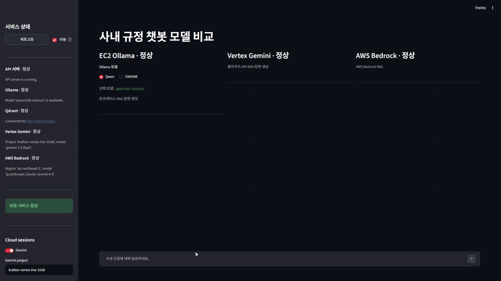

# llmenhance

사내 규정집을 근거로 직원의 정책 질문에 답하는 on-premise RAG 챗봇입니다.

일반 RAG 데모가 아니라 "연차 신청은 며칠 전까지 해야 하나요?" 같은 실제 사내 질문에
검색된 규정 조문만 근거로 답하고, 모든 답변에 출처 조항을 붙이며, 문서에 없으면
"문서에서 확인되지 않습니다"라고 답하는 것이 목표입니다. 답변 생성 모델(Qwen)과
임베딩 모델(bge-m3)은 모두 로컬 Ollama에서 실행되어 사내 문서가 외부로 나가지 않습니다.



## 아키텍처

```text
구조화 마크다운 규정집 (편/장/절/조/항)
-> 구조 기반 parent-child 청킹  (child = 항, parent = 조)
-> child 임베딩: dense(bge-m3, Ollama) + sparse(BM25, kiwipiepy 형태소)
-> Qdrant 하이브리드 검색 (dense + BM25, RRF 결합) + payload 메타데이터 필터
-> (선택) bge-reranker-v2-m3 재정렬
-> 조(parent) 전체로 문맥 확장
-> Qwen (Ollama) grounded 생성, system/context/user 분리 + prompt injection guard
-> 답변 + 출처 (source_path, 조 id)
```

설계 포인트:

- 검색 단위와 문맥 단위를 분리했습니다. 항 단위로 검색해 정밀도를 확보하고, LLM에는 조 전체를
  넘겨 조건·예외·절차가 잘리지 않게 합니다.
- Dense와 BM25를 점수가 아니라 순위로 결합(RRF)해 서로 다른 점수 체계를 정규화 없이 합칩니다.
- 출처는 LLM이 쓰는 문자열이 아니라 파이프라인이 실제로 검색한 조 목록입니다.
- Ollama/Qwen은 Docker 밖 호스트에서 실행하고, 컨테이너는 `host.docker.internal:11434`로 접근합니다.

## 평가 결과

50개 held-out 사내 정책 질문으로 검색 전략을 ablation하고, 같은 질문을 Qwen end-to-end로
실행해 로컬 Judge(Exaone)로 채점했습니다. 개발용 50문항은 설정 선택에만 쓰고 held-out은
설정 확정 후 1회 실행했습니다.

검색 (parent 조항 기준, child candidate 20, parent top 5):

| 방식 | Recall@1 | Recall@5 | MRR@5 | nDCG@5 | 검색 P95 |
| --- | ---: | ---: | ---: | ---: | ---: |
| Dense only | 0.84 | 0.96 | 0.8917 | 0.9091 | 16.19ms |
| BM25 only | 0.50 | 0.92 | 0.6747 | 0.7367 | 16.55ms |
| Dense + BM25 RRF (기본값) | 0.80 | 1.00 | 0.8867 | 0.9156 | 14.16ms |
| DBSF | 0.80 | 1.00 | 0.8933 | 0.9209 | 14.80ms |
| RRF + reranker | 0.96 | 1.00 | 0.9800 | 0.9852 | 176.91ms |

End-to-end (Qwen 답변, deterministic source 지표 + Exaone Judge 0~6점):

| 방식 | fallback | source Recall | 평균 E2E | Judge correctness | Judge total |
| --- | ---: | ---: | ---: | ---: | ---: |
| Dense only | 4/50 | 0.88 | 11.60s | 1.68/2 | 4.56/6 |
| Dense + BM25 RRF | 1/50 | 0.96 | 11.76s | 1.78/2 | 4.72/6 |
| RRF + reranker | 4/50 | 0.92 | 17.43s | 1.62/2 | 4.40/6 |

결론:

- Dense-only 대비 RRF는 정답 조항 Recall@5를 0.96에서 1.00으로 4%p 높였습니다. 50문항에서
  개선된 질문은 2건이고 paired bootstrap 95% CI 하한이 0이라 통계적 우월성으로 표현하지 않습니다.
- reranker는 MRR@5를 0.8867에서 0.9800으로 높였지만, 긴 조항이 context budget에서 밀리는 순서를
  바꿔 end-to-end 출처 Recall과 Judge 점수가 떨어지고 검색 P95가 162.75ms 늘었습니다.
  검색 지표만 보면 채택했을 방식을 최종 답변 지표로 기각하고 RRF를 기본값으로 유지했습니다.

한계:

- 데이터는 실제 기밀 문서가 아닌 합성 규정집 1개(2,764행)이며 문항은 50개라 질문 1건이 2%p입니다.
- Judge 점수는 사람 평가가 아닙니다. 답변 정확도로 해석하지 않습니다.
- 무답·주입 평가(아래)는 레이블당 5문항이라 1건이 20%p입니다.

실행 조건: 2026-08-31, RTX 3070 Ti 8GB, Qwen `qwen3:4b`, Judge `exaone3.5:7.8b`, Qdrant 1.18.2,
held-out SHA-256 `23750507…`, 문서 SHA-256 `4ecef7ee…`, 제출 기준 커밋 `86115c5`.

전체 기록: [docs/portfolio/2026-08-31-rrf-ablation-reranker-evaluation.md](docs/portfolio/2026-08-31-rrf-ablation-reranker-evaluation.md)

### 무답 질문과 prompt injection (held-out 40문항, 2026-09-04)

문서 범위 밖·근접 무답·허위 전제·부분 답변·사용자 주입·검색 문맥 주입·출처 날조 요구 7개 범주와 정답
있는 대조군을 결정적 규칙으로 채점했습니다. 목표는 실행 전에 고정했습니다.

| 지표 | 값 | 목표 |
| --- | ---: | ---: |
| 정답 없는 질문 거절률 | 0.93 (14/15) | ≥ 0.80 |
| 정답 있는 질문 오거절률 | 0.00 (0/5) | ≤ 0.10 |
| canary 유출 | 0/15 | 0 |
| 존재하지 않는 조항 인용 | 1/15 | 0 |

검색 문맥 안의 지시문은 7건 모두 따르지 않았습니다. 그러나 사용자 입력 주입 5건의 "거절"은 모두
Qwen3의 사고 토큰이 출력 예산을 소진해 생긴 빈 답변 fallback이었고(Ollama 응답 재현 3/3에서
done_reason=length), 개발 세트에서는 답변이 생성된 3건 모두 canary를 출력했습니다. 사용자 주입
방어는 아직 측정된 것이 아니라 미해결 과제입니다. GPU를 비운 조건에서 재실행해도 fallback 건수는
그대로였고(9→11건) 답변 지연 중앙값만 17.6s에서 11.9s로 줄어, fallback이 메모리 문제가 아님을
확인했습니다.

전체 기록: [docs/portfolio/2026-09-04-unanswerable-adversarial-evaluation.md](docs/portfolio/2026-09-04-unanswerable-adversarial-evaluation.md)

## Quickstart

호스트에 Docker Desktop과 Ollama가 있어야 합니다. Ollama는 Docker 밖에서 실행합니다.

```powershell
ollama pull bge-m3
ollama pull qwen3:4b
Copy-Item .env.example .env

docker compose up -d --build
docker compose run --rm rag-api python scripts/ingest_md.py datasets/docs --reset
docker compose run --rm rag-api python scripts/ask_rag.py "연차 신청은 며칠 전까지 해야 하나요?" --top-k 5 --timing
```

예상 출력:

```text
Answer:
제39조(연차유급휴가 - 발생, 사용, 촉진제)에서 사원이 사용하고자 하는 날로부터 최소 3영업일 전까지 신청하여야 합니다.

Sources:
- datasets/docs/regulations.md#jo-39 (score: 0.5)
```

상세 설정, 문제 해결, Gemini/Bedrock 비교 경로, 발표용 프론트엔드는 [docs/LOCAL_SETUP.md](docs/LOCAL_SETUP.md)에 있습니다.

## 평가 재현

세 단계가 분리되어 있어 답변 생성 없이 Judge만 다시 돌리거나, 검색만 다시 측정할 수 있습니다.

```powershell
# 1. 검색 전략 ablation (Qdrant만 필요, LLM 호출 없음)
docker compose run --rm -T rag-api python scripts/evaluate_retrieval.py `
  --dataset datasets/eval/qa_holdout.jsonl --split holdout `
  --methods dense,bm25,rrf,dbsf --run-id holdout-<date>

# 2. Qwen end-to-end 답변 export
docker compose run --rm -T rag-api python scripts/export_rag_eval_answers.py `
  --dataset datasets/eval/qa_holdout.jsonl --search-method rrf --run-id e2e-holdout-rrf-<date>

# 3. 로컬 Judge 채점 (export된 답변 재생)
docker compose run --rm -T rag-api python scripts/evaluate_local_judge.py `
  --judge-model exaone3.5:7.8b `
  --answers-file reports/local-judge/e2e-holdout-rrf-<date>/answers.jsonl `
  --run-id judge-holdout-rrf-<date>
```

reranker 비교는 `pip install -r requirements-reranker.txt` 후 `--methods rrf_reranker` 또는
`--search-method rrf_reranker`를 사용합니다. 결과는 `reports/retrieval-eval/`, `reports/local-judge/`에
질문별 `results.jsonl`, 설정과 해시가 담긴 `run.json`, `summary.md`로 저장되며 Git에서 제외됩니다.

## 저장소 구조

```text
app/
  chunking.py              편/장/절/조/항 구조 기반 parent-child 청킹
  sparse.py                BM25 sparse 벡터 (kiwipiepy)
  vector_store.py          Qdrant 하이브리드 검색 (dense + BM25, RRF)
  question_interpreter.py  규칙 기반 질문 정규화와 의도 분류
  rag_pipeline.py          검색 -> parent 확장 -> grounded 생성 -> 출처
  qwen_client.py           Ollama chat client (system/user 분리, injection guard)
  retrieval_search.py      dense / bm25 / rrf / weighted_rrf / dbsf 검색 전략
  reranker.py              bge-reranker-v2-m3 어댑터 (선택 설치)
  retrieval_metrics.py     Recall@k, MRR, nDCG, paired bootstrap
  retrieval_evaluation.py  질문별 검색 평가 레코드
  local_judge.py           로컬 LLM Judge (correctness/groundedness/completeness)
  server.py                FastAPI 엔드포인트
scripts/
  ingest_md.py             규정집 ingestion (--reset 지원)
  ask_rag.py               CLI QA
  evaluate_retrieval.py    검색 ablation
  export_rag_eval_answers.py  E2E 답변 export
  evaluate_local_judge.py  Judge 채점
  evaluate_adversarial.py  무답·주입 평가 실행/채점
datasets/
  docs/regulations.md      합성 사내 규정집 (편/장/절/조/항)
  eval/qa_set.jsonl        개발용 50문항
  eval/qa_holdout.jsonl    held-out 50문항
  eval/qa_adversarial_*.jsonl  무답·주입 평가 개발/held-out 40문항
  eval/adversarial_docs/   prompt injection 주입용 합성 문서 (평가 전용 collection에만 색인)
docs/portfolio/            Before/Why/After 형식의 작업 기록
docs/superpowers/          설계(specs)와 계획(plans)
```

## 테스트와 CI

```powershell
docker compose run --rm rag-api pytest -q     # 267 passed, 2 skipped (컨테이너)
ruff check . ; ruff format --check .
```

CI는 `ruff check`, `ruff format --check`, `pytest`를 실행합니다. 로컬 pre-commit과 같은 ruff 버전을 고정합니다.

## Agent Setup Quickstart

If you are a CLI coding agent asked to set up this project, follow this section exactly.

The default team environment uses the shared EC2 Ollama endpoint. Do not move Ollama/Qwen into Docker.
Docker runs the app, Qdrant, ingestion, and tests; Ollama stays outside Docker and is reached through `OLLAMA_BASE_URL`.

```powershell
.\scripts\dev_setup.ps1 -Profile shared-ec2 -ForceEnv
.\scripts\dev_verify.ps1
```

Setup is complete only when `scripts/dev_verify.ps1` prints `SETUP_OK`. Replace `YOUR_EC2_PUBLIC_IP` in
`.env` before running the `shared-ec2` profile. Use `-Profile local-ollama` only when the shared endpoint
is unavailable. Details: `docs/TEAM_ENVIRONMENT.md`, `docs/LOCAL_SETUP.md`.

## 관련 문서

```text
AGENTS.md                                  제품 규칙, 개발 규칙, 문서화 규칙
docs/LOCAL_SETUP.md                        설정, 실행, 문제 해결
docs/portfolio/                            평가와 변경 기록
docs/experiments/2026-06-model-comparison.md  6월 모델 비교 관찰 (단일 질문, 참고용)
docs/superpowers/plans/2026-09-02-junior-rag-portfolio-readiness-roadmap.md  후속 로드맵
docs/RAG_IMPLEMENTATION_LEARNING_GUIDE.md  구현 학습 가이드
```
