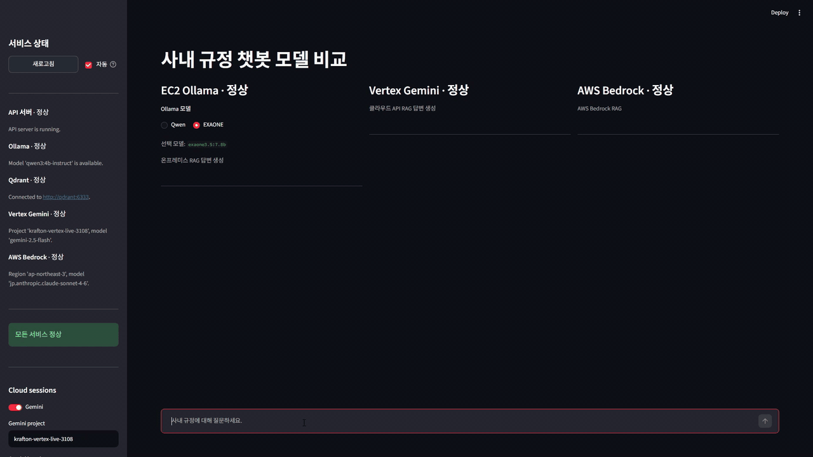

# llmenhance

## Live QA Demo

Qwen live QA:


EXAONE live QA:



`llmenhance`는 사내 규정과 회사 문서를 기반으로 직원 질문에 답하는 RAG 챗봇 MVP입니다.

목표는 일반적인 RAG 데모가 아니라, 직원이 실제로 묻는 회사 정책 질문에 대해 검색된 내부 문서 chunk만 근거로 답하고, 모든 답변에 source를 남기는 것입니다.

## Agent Setup Quickstart

If you are a CLI coding agent asked to set up this project, follow this section exactly.

The default team environment uses the shared EC2 Ollama endpoint. Do not move Ollama/Qwen into Docker. For the MVP, Docker runs the app, Qdrant, ingestion, and tests locally; Ollama model serving stays outside Docker and is reached through `OLLAMA_BASE_URL`.

From the repository root, run:

```powershell
.\scripts\dev_setup.ps1 -Profile shared-ec2 -ForceEnv
.\scripts\dev_verify.ps1
```

Setup is complete only when `scripts/dev_verify.ps1` prints:

```text
SETUP_OK
```

What the scripts do:

```text
scripts/dev_setup.ps1
- creates .env from .env.shared-ec2.example
- checks Docker Desktop
- verifies the shared EC2 Ollama API endpoint
- verifies bge-m3 and qwen3:4b-instruct are available on EC2
- builds and starts Docker Compose services
- rebuilds the Qdrant index from datasets/docs

scripts/dev_verify.ps1
- checks the active TEAM_ENV_PROFILE and OLLAMA_BASE_URL
- verifies the configured Ollama endpoint and required models
- checks Qdrant at localhost:6333
- runs app.healthcheck
- runs pytest
- asks one sample policy question
- verifies that Sources are present
```

The shared profile creates `.env` from `.env.shared-ec2.example` and uses:

```env
TEAM_ENV_PROFILE=shared-ec2
OLLAMA_BASE_URL=http://YOUR_EC2_PUBLIC_IP:11434
LLM_MODEL=qwen3:4b-instruct
EMBEDDING_MODEL=bge-m3
```

Before running `shared-ec2`, replace `YOUR_EC2_PUBLIC_IP` with the EC2 host that serves Ollama on port `11434`.

Use the local Ollama fallback only when the shared EC2 endpoint is unavailable or when explicitly asked:

```powershell
.\scripts\dev_setup.ps1 -Profile local-ollama -ForceEnv
.\scripts\dev_verify.ps1
```

Do not claim setup is complete unless `SETUP_OK` is printed. Do not commit `.env`, `.env.backup.*`, `storage/`, local DB files, Qdrant vector data, model files, or local credentials.

Detailed team environment notes are in `docs/TEAM_ENVIRONMENT.md`. Local-only setup notes are in `docs/LOCAL_SETUP.md`.

예상 질문:

```text
연차 신청은 며칠 전까지 해야 하나요?
재택근무 승인 절차는 어떻게 되나요?
출장비 정산은 언제까지 해야 하나요?
경비 처리 시 어떤 증빙이 필요한가요?
법인카드 사용 후 전표 처리는 언제까지 해야 하나요?
개인정보가 포함된 문서는 어떻게 보관해야 하나요?
```

## 현재 상태 요약

현재 main에 올리는 상태는 다음 기능까지 구현되어 있습니다.

```text
구조화 마크다운 규정집(regulations.md)
-> 구조 기반 청킹(편/장/절/조/항, parent-child)
-> 항(child) 임베딩: dense(bge-m3) + sparse(BM25, kiwipiepy)
-> Qdrant 하이브리드 검색(dense + BM25, RRF 결합) + (선택) payload 메타데이터 필터
-> 조(parent) 전체로 확장
-> LLM answer generation
-> Answer + Sources 출력
```

구현된 실행 경로는 두 가지입니다.

```text
1. 로컬/on-prem MVP 경로
   scripts/ask_rag.py
   -> host Ollama의 Qwen 계열 모델 호출

2. 속도 비교용 실험 경로
   scripts/ask_rag_gemini.py
   -> 동일한 RAG 검색 결과를 Vertex Gemini 2.5 Flash로 생성
```

중요한 원칙:

```text
- MVP의 기본 스토리는 on-prem/local입니다.
- Ollama/Qwen은 Docker 안에 넣지 않고 Windows host의 Ollama를 호출합니다.
- rag-api container는 host.docker.internal:11434로 host Ollama에 접근합니다.
- Qdrant와 rag-api는 Docker Compose로 실행합니다.
- Qwen/Gemini 생성 전에는 Qdrant 하이브리드 검색 결과(조 전체)로 context를 먼저 구성합니다.
- 답변에는 source_path와 chunk_id가 포함되어야 합니다.
- 검색된 context에 답이 없으면 문서에서 확인되지 않는다고 답해야 합니다.
```

## 역할 분담 제안

이번 공유 이후 팀원 2명에게 다음처럼 나누면 됩니다.

### 1. RAG 성능 개선 담당

LLM 모델은 고정하고, RAG 파이프라인 병목을 줄이는 역할입니다.

관찰 대상:

```text
[1/4] Embedding question
[2/4] Searching Qdrant (dense + BM25 하이브리드)
[3/4] Expanding to parent articles
[4/4] LLM generation
```

우선순위:

```text
1. embedding latency 측정 및 개선
2. top_k와 RRF dense/sparse 가중치 조합별 retrieval 품질/속도 비교
3. context 길이(조 전체 확장)가 답변 품질과 생성 속도에 주는 영향 확인
4. dense 단독 vs dense+BM25 하이브리드의 검색 품질 비교
5. Qdrant 하이브리드 검색 latency 측정
6. 동일 질문 반복 시 embedding cache 또는 query result cache 검토
```

주의:

```text
- RAG 담당자는 LLM 모델을 계속 바꾸기보다 RAG 단계별 시간을 줄이는 데 집중합니다.
- 검색 품질이 떨어지는 최적화는 적용하지 않습니다.
- source가 사라지거나 문서 밖 추론이 늘어나면 실패로 봅니다.
```

### 2. LLM 모델 변경 및 속도 측정 담당

RAG 검색 흐름은 그대로 두고 마지막 생성 모델만 바꾸며 속도와 답변 품질을 비교하는 역할입니다.

비교 대상 예시:

```text
qwen3:4b
qwen3:4b-instruct
qwen2.5:7b
gemini-2.5-flash
```

측정 기준:

```text
- LLM generation time
- end-to-end latency
- RAM 사용량
- 답변이 한국어로 나오는지
- 불필요한 thinking/reasoning이 출력되는지
- 문서 source에 근거한 답변인지
- 답변 길이가 max output token 안에서 끊기지 않는지
```

현재 관찰된 결과:

```text
qwen3:4b
- NUM_PREDICT=256
- Qwen generation: 약 45.237s
- 영어 reasoning이 출력되어 QA 응답 품질이 낮았음

qwen3:4b-instruct
- NUM_PREDICT=192
- NUM_CTX=2048
- top_k=3
- Qwen generation: 약 28.692s
- 한국어 답변 품질은 개선됐지만 여전히 느림

gemini-2.5-flash
- 동일 RAG 검색 결과를 Vertex API로 생성
- thinking_budget=0
- Gemini generation: 약 2.1s ~ 3.3s
- 로컬 RAM 사용량 부담 없음
```

### 2026-06-18 RAG harness vs pure model 비교

이번 비교는 `모델 자체 성능`과 `RAG 하네스를 적용한 업무 QA 성능`을 분리해서 보기 위한 실험입니다.

#### 1. RAG 하네스를 통과한 정책 QA

질문:

```text
법인카드 사용 후 전표 처리는 언제까지 해야 하나요?
```

동일하게 적용한 하네스:

```text
질문 dense(bge-m3) + sparse(BM25) 변환
-> Qdrant 하이브리드 검색(RRF)
-> 조(parent) 전체로 확장
-> grounded prompt
-> source references 출력
```

| Model | 실행 위치 | Generation | 핵심 답변 | Source |
| --- | --- | ---: | --- | --- |
| gemini-2.5-flash | Vertex API | 2.415s | 법인카드 사용 후 7영업일 이내에 사용 목적과 참석자(해당 시)를 명시하여 전표 처리 | datasets/docs/regulations.md#jo-62 |
| qwen2.5:7b | AWS EC2 g4dn.xlarge + Ollama | 4.725s | 법인카드 사용 후 7영업일 이내에 전표 처리하며 업무 관련 비용에 한해 사용 가능 | datasets/docs/regulations.md#jo-62 |

관찰:

```text
- 두 모델 모두 같은 Qdrant 하이브리드 검색 결과와 parent 확장 context를 사용했습니다.
- 두 모델 모두 동일한 핵심 조치와 동일한 source를 반환했습니다.
- Qwen 답변의 추가 문장도 검색된 조(parent) context 안의 내용에 근거한 것이므로 hallucination으로 보지 않았습니다.
- 따라서 RAG 하네스를 통과하면 모델이 달라도 정책 QA의 핵심 답변이 거의 일치했습니다.
```

#### 2. RAG 없는 순수 모델 비교

질문:

```text
피타고라스 정리에 대해 중학생도 이해할 수 있게 한국어로 간결하게 설명해줘.
수식 a²+b²=c² 와 3-4-5 숫자 예시를 포함해줘. 이모지는 사용하지 마.
```

| Model | 실행 위치 | Generation | 품질 메모 |
| --- | --- | ---: | --- |
| gemini-2.5-flash | Vertex API | 6.114s | 직각삼각형, 빗변, 공식, 3-4-5 예시를 자연스럽고 정확하게 설명 |
| qwen2.5:7b | AWS EC2 g4dn.xlarge + Ollama | 4.043s warm / 40.313s cold warm-up | 공식과 3-4-5 계산은 맞았지만, 첫 문장에서 `직각삼각형의 둘레 길이에 대한 규칙`이라고 설명해 개념 표현 오류가 있었음 |

해석:

```text
- RAG가 없는 일반 지식 설명에서는 Gemini 2.5 Flash가 Qwen2.5:7b보다 설명 품질이 확실히 좋았습니다.
- Qwen2.5:7b는 짧고 빠르게 답했지만, 피타고라스 정리를 "둘레 길이" 규칙처럼 표현하는 오류가 있었습니다.
- 반대로 RAG + Qdrant 하이브리드 검색 + source 기반 grounded prompt를 적용한 정책 질문에서는 두 모델의 답변 차이가 크게 줄었습니다.
- 즉, 이 프로젝트의 RAG 하네스는 단순 검색 부가 기능이 아니라 모델 성능 편차를 줄이고 업무 QA 답변을 안정화하는 장치입니다.
- MVP 관점에서는 Gemini가 순수 모델 성능과 속도에서 우위지만, on-prem/local Qwen도 문서 근거가 충분한 정책 QA에서는 실사용 가능한 답변으로 수렴할 가능성이 있습니다.
```

주의:

```text
- Gemini 경로는 속도 비교용 실험 경로입니다.
- MVP의 기본 배포 방향은 여전히 local/on-prem Qwen 경로입니다.
- gemini-2.5-flash는 thinking budget을 끄지 않으면 짧은 max_output_tokens에서 답변이 끊길 수 있습니다.
```

## Repository 구조

```text
app/
  chunking.py          편/장/절/조/항 구조 기반 parent-child 청킹
  config.py            환경 변수 기반 설정
  embeddings.py        Ollama embedding client (dense, bge-m3)
  gemini_client.py     Vertex Gemini 비교용 client
  healthcheck.py       runtime 설정 확인
  qwen_client.py       Ollama Qwen chat client
  rag_pipeline.py      기본 Qwen RAG pipeline (하이브리드 검색 + parent 확장)
  sparse.py            BM25 sparse 벡터 생성 (kiwipiepy 형태소 토큰화)
  vector_store.py      Qdrant 하이브리드(dense+BM25) vector store

scripts/
  ingest_md.py         Markdown 문서 ingestion
  ask_rag.py           기본 Qwen RAG QA CLI
  ask_rag_gemini.py    Gemini 생성 비교용 RAG QA CLI

datasets/docs/
  regulations.md       편/장/절/조/항 구조의 단일 사내 규정집

tests/
  test_chunking.py
  test_ingest_md.py
  test_ollama_clients.py
  test_rag_pipeline.py
  test_sparse.py
  test_vector_store.py
  test_gemini_client.py
  test_ask_rag_gemini.py
```

## 현재 모델 구성

기본 `.env.example`:

```env
OLLAMA_BASE_URL=http://host.docker.internal:11434
LLM_MODEL=qwen3:4b-instruct
EMBEDDING_MODEL=bge-m3

QDRANT_URL=http://qdrant:6333
QDRANT_COLLECTION=llmenhance_chunks

RETRIEVAL_TOP_K=5
TEMPERATURE=0.2
NUM_CTX=4096
NUM_PREDICT=512
```

실험 중 자주 바꾼 값:

```powershell
-e LLM_MODEL=qwen3:4b-instruct
-e NUM_PREDICT=192
-e NUM_CTX=2048
```

embedding model:

```text
bge-m3
```

`bge-m3`는 답변 생성 모델이 아니라 검색용 embedding 모델입니다. 삭제하면 ingestion과 질문 embedding이 실패합니다.

## 사전 준비

### 1. Docker Desktop 실행

Windows에서 Docker Desktop이 실행 중이어야 합니다.

확인:

```powershell
docker version
docker compose version
```

### 2. Ollama 실행

Ollama는 Docker container 안이 아니라 Windows host에서 실행합니다.

확인:

```powershell
ollama list
```

필요 모델 설치:

```powershell
ollama pull bge-m3
ollama pull qwen3:4b-instruct
```

팀 기본 `.env`는 `qwen3:4b-instruct`를 사용합니다. 로컬 PC RAM이 부족하면 더 작은 모델부터 테스트합니다.

```powershell
ollama pull qwen3:4b-instruct
ollama pull qwen2.5:7b
```

### 3. 환경 변수 파일 생성

```powershell
Copy-Item .env.example .env
```

작은 모델로 바로 테스트하려면 `.env`의 `LLM_MODEL`을 바꾸거나 실행 시 `-e`로 override합니다.

## Docker 실행법

### 1. 서비스 실행

```powershell
docker compose up -d
```

현재 compose 서비스:

```text
qdrant
rag-api
```

Qdrant 확인:

```powershell
curl.exe http://localhost:6333
```

healthcheck:

```powershell
docker compose run --rm rag-api python -m app.healthcheck
```

예상 출력:

```text
llmenhance rag-api healthcheck
LLM model: qwen3:4b-instruct
Embedding model: bge-m3
Ollama base URL: http://host.docker.internal:11434
Qdrant URL: http://qdrant:6333
Qdrant collection: llmenhance_chunks
```

### 2. 문서 ingestion

처음 실행하거나 문서/chunk 설정/embedding 모델을 바꿨다면 reset indexing을 권장합니다.

```powershell
docker compose run --rm rag-api python scripts/ingest_md.py datasets/docs --reset
```

일반 upsert만 하려면:

```powershell
docker compose run --rm rag-api python scripts/ingest_md.py datasets/docs
```

현재 문서:

```text
datasets/docs/regulations.md
```

연차·재택·출장비·경비·개인정보·보안 등 정책 주제를 편/장/절/조/항 구조로 담은 단일 규정집입니다.

## 기본 Qwen RAG QA 실행

자연어 질문은 별도 필터 없이 그대로 묻습니다.

```powershell
docker compose run --rm rag-api python scripts/ask_rag.py "연차 신청은 며칠 전까지 해야 하나요?" --top-k 5 --timing
docker compose run --rm rag-api python scripts/ask_rag.py "출장비 정산은 언제까지 해야 하나요?" --top-k 5 --timing
docker compose run --rm rag-api python scripts/ask_rag.py "법인카드 사용 후 전표 처리는 언제까지 해야 하나요?" --top-k 5 --timing
```

특정 장/조나 메타데이터로 검색 범위를 좁히고 싶을 때만 `--filter KEY=VALUE`(반복 가능)를 붙입니다. 질문 내용에서 장/조를 자동으로 뽑아내지는 않습니다.

```powershell
docker compose run --rm rag-api python scripts/ask_rag.py "휴가 신청 절차" --filter "jang=제2장 인사 관리" --top-k 5
```

필터를 사용한 경우 예상 출력 형태:

```text
[1/4] Embedding question...
[timing] Embedding question: 0.400s
[2/4] Searching Qdrant (metadata filter)...
[timing] Qdrant search: 0.051s
[3/4] Expanding to parent articles...
[timing] Parent expansion: 0.000s
[4/4] Generating answer with Qwen...
[timing] Qwen generation: 18.262s

Answer:
제39조(연차유급휴가 - 발생, 사용, 촉진제)에서 사원이 사용하고자 하는 날로부터 최소 3영업일 전까지 신청하여야 합니다.

Sources:
- datasets/docs/regulations.md#jo-39 (score: 0.5)
- datasets/docs/regulations.md#jo-36 (score: 0.33333334)
```

## Gemini 비교 실행

Gemini 비교는 기존 Docker RAG infra를 그대로 사용하고 마지막 생성 모델만 Vertex Gemini로 바꿉니다.

즉, 아래 단계는 동일합니다.

```text
질문 dense(bge-m3) + sparse(BM25) 변환
-> Qdrant 하이브리드 검색(RRF)
-> 조(parent) 전체로 확장
-> Gemini generation
```

### 인증 전제

host에서 Google ADC가 설정되어 있어야 합니다.

```powershell
gcloud auth application-default login
gcloud config set project krafton-vertex-live-3108
```

ADC 파일 확인:

```powershell
Test-Path "$env:APPDATA\gcloud\application_default_credentials.json"
```

### 실행 명령

```powershell
docker compose run --rm `
  -e GOOGLE_CLOUD_PROJECT=krafton-vertex-live-3108 `
  -e GOOGLE_CLOUD_LOCATION=us-central1 `
  -e GOOGLE_APPLICATION_CREDENTIALS=/tmp/gcloud_adc.json `
  -v "$env:APPDATA\gcloud\application_default_credentials.json:/tmp/gcloud_adc.json:ro" `
  rag-api python scripts/ask_rag_gemini.py "법인카드 사용 후 전표 처리는 언제까지 해야 하나요?" --top-k 5 --max-output-tokens 256 --timing
```

현재 관찰된 결과 예시:

```text
[timing] Embedding question: 0.519s
[timing] Qdrant search: 0.064s
[timing] Gemini generation: 2.126s

Answer:
법인카드 사용 후 7영업일 이내에 사용 목적과 참석자(해당 시)를 명시하여 전표 처리해야 합니다...

Sources:
- datasets/docs/regulations.md#jo-62 (score: 0.5)
```

`ask_rag_gemini.py`의 기본값:

```text
model: gemini-2.5-flash
thinking_budget: 0
```

`gemini-2.5-flash`는 thinking을 켜면 짧은 `max_output_tokens`에서 답변이 중간에 끊길 수 있습니다. 그래서 QA 속도 비교에서는 기본적으로 thinking을 끕니다.

dynamic thinking을 실험하려면:

```powershell
--thinking-budget -1
```

## Presentation Split Chat Frontend

발표용 프론트엔드는 화면을 반반 나눠 왼쪽에는 local `Ollama + Qwen` RAG 챗봇을, 오른쪽에는 `AWS Bedrock` API 모델 RAG 챗봇을 보여줍니다.

저장된 데모 결과만으로도 화면을 열 수 있습니다.

```powershell
docker compose run --rm -p 8787:8787 rag-api python scripts/presentation_frontend.py --host 0.0.0.0 --port 8787
```

브라우저에서 엽니다.

```text
http://localhost:8787
```

저장된 결과는 AWS credentials 없이 동작합니다. `두 챗봇 실시간 실행` 버튼은 컨테이너에서 사용할 수 있는 AWS credentials와 `BEDROCK_MODEL_ID` 설정이 필요합니다.

## Timing 로그 해석

`--timing`을 붙이면 단계별 병목을 볼 수 있습니다.

```text
Embedding question
- 질문을 bge-m3 dense embedding으로 바꾸는 시간 (sparse 토큰화는 여기서 함께 처리)

Qdrant search
- dense + BM25 sparse 하이브리드 검색 + RRF 결합 시간

Parent expansion
- 검색된 여러 항(child)을 각각의 조(parent)로 매핑하고 중복을 제거한 후, payload의 조 전체 본문으로 context를 만드는 시간

Qwen generation / Gemini generation
- 최종 LLM 답변 생성 시간
```

현재 병목은 대부분 마지막 LLM generation입니다.

## Source 검증 방법

`Sources`는 LLM이 만들어낸 문자열이 아니라, RAG 파이프라인이 실제로 검색한 조(parent) 목록입니다.
출처의 모든 정보(조 전체 본문·source_path·title·구조 메타데이터)는 Qdrant payload에 저장돼 있습니다.

답변이 RAG에서 온 것인지 확인하려면 `Sources`에 찍힌 조 id(예: `jo-39`)로 Qdrant payload를 직접 열어봅니다.

```powershell
@'
from qdrant_client import QdrantClient, models
from app.config import Settings

settings = Settings.from_env()
client = QdrantClient(url=settings.qdrant_url)

# 해당 조(parent)에 속한 항(child) 포인트 하나에서 조 전체 본문(parent_text)을 읽는다.
points, _ = client.scroll(
    collection_name=settings.qdrant_collection,
    scroll_filter=models.Filter(
        must=[models.FieldCondition(key="parent_id", match=models.MatchValue(value="jo-39"))]
    ),
    limit=1,
    with_payload=True,
)

payload = points[0].payload
print("source_path:", payload["source_path"])
print("title:", payload["title"])
print("path:", payload["path"])
print()
print(payload["parent_text"])
'@ | docker compose run --rm -T rag-api python -
```

Qwen/Gemini에게 실제로 전달된 `[context]` prompt를 보고 싶으면:

```powershell
@'
from app.config import Settings
from app.embeddings import embed_text
from app.sparse import text_to_sparse
from app.vector_store import search_chunks
from app.rag_pipeline import _build_context

question = "연차 신청은 며칠 전까지 해야 하나요?"

settings = Settings.from_env()
dense = embed_text(settings.ollama_base_url, settings.embedding_model, question)
sparse = text_to_sparse(question)

search_results = search_chunks(
    settings.qdrant_url,
    settings.qdrant_collection,
    dense,
    sparse,
    5,
)

parents, user_prompt = _build_context(question, search_results, 5)
print(user_prompt)
'@ | docker compose run --rm -T rag-api python -
```

## 모델별 실험 기록 템플릿

팀원이 모델을 바꿔가며 테스트할 때 아래 표를 채우면 됩니다.

| Date | Model | NUM_CTX | NUM_PREDICT | top_k | Embedding | Search | Generation | Total | RAM | 품질 메모 |
| --- | --- | ---: | ---: | ---: | ---: | ---: | ---: | ---: | ---: | --- |
| 2026-06-18 | qwen3:4b | default | 256 | 5 | 0.456s | 0.033s | 45.237s | - | - | 영어 reasoning 출력 |
| 2026-06-18 | qwen3:4b-instruct | 2048 | 192 | 3 | 1.966s | 0.030s | 28.692s | - | - | 한국어 답변 정상 |
| 2026-06-18 | gemini-2.5-flash | - | 256 | 3 | 0.519s | 0.064s | 2.126s | - | host RAM 부담 없음 | 답변 정상 |
| 2026-06-18 | gemini-2.5-flash(RAG) | - | 256 | 3 | 3.409s | 0.184s | 2.415s | - | host RAM 부담 없음 | Qwen과 핵심 답변 및 source 거의 일치 |
| 2026-06-18 | qwen2.5:7b(RAG) | default | 256 | 3 | 2.417s | 0.193s | 4.725s | - | EC2 GPU 사용 | Gemini와 핵심 답변 및 source 거의 일치 |
| 2026-06-18 | gemini-2.5-flash(순수 모델) | - | 512 | - | - | - | 6.114s | - | host RAM 부담 없음 | 피타고라스 설명 정확도와 자연스러움 우수 |
| 2026-06-18 | qwen2.5:7b(순수 모델) | default | 512 | - | - | - | 4.043s warm | - | EC2 GPU 사용 | 공식은 맞았지만 `둘레 길이` 표현 오류. cold warm-up 40.313s |

## 테스트

Docker 기준 전체 테스트:

```powershell
docker compose run --rm rag-api pytest -v
```

현재 확인된 테스트:

```text
108 passed
```

추가 확인:

```powershell
docker compose up -d
curl.exe http://localhost:6333
docker compose run --rm rag-api python -m app.healthcheck
git diff --check
```

CI에서 사용하는 로컬 개발 도구:

```powershell
python -m pip install -r requirements-dev.txt
ruff check .
ruff format --check .
pytest
```

## 자주 생기는 문제

### 1. Ollama 연결 실패

증상:

```text
Connection refused
host.docker.internal:11434
```

확인:

```powershell
ollama list
```

해결:

```text
- Windows host에서 Ollama가 실행 중인지 확인
- .env의 OLLAMA_BASE_URL이 http://host.docker.internal:11434인지 확인
- Docker Desktop 재시작
```

### 2. Qwen 답변이 너무 느림

확인:

```powershell
--timing
```

대응:

```text
- 작은 모델 사용: qwen3:4b-instruct
- NUM_PREDICT 줄이기: 192 또는 256
- NUM_CTX 줄이기: 2048
- top_k 줄이기: 3
- Qwen think=false 유지
```

### 3. Gemini 답변이 중간에 끊김

원인:

```text
gemini-2.5-flash의 dynamic thinking이 출력 토큰 예산을 많이 사용할 수 있음
```

대응:

```powershell
--thinking-budget 0
```

현재 `ask_rag_gemini.py` 기본값은 `0`입니다.

### 4. 저장공간 부족

Ollama 모델 확인:

```powershell
ollama list
```

불필요 모델 삭제:

```powershell
ollama rm qwen3:4b
ollama rm qwen2.5:7b
```

주의:

```text
bge-m3는 embedding 모델이므로 RAG 검색에 필요합니다.
삭제하면 ingestion/query embedding이 실패합니다.
```

메모리에서 unload:

```powershell
ollama stop qwen3:4b-instruct
ollama stop bge-m3
```

### 5. Qdrant 데이터가 꼬인 것 같음

reset ingestion:

```powershell
docker compose run --rm rag-api python scripts/ingest_md.py datasets/docs --reset
```

Docker volume까지 완전히 지우는 것은 마지막 수단입니다.

```powershell
docker compose down -v
docker compose up -d
docker compose run --rm rag-api python scripts/ingest_md.py datasets/docs --reset
```

## Git에 올리면 안 되는 것

다음은 commit하지 않습니다.

```text
.env
storage/
*.sqlite
.pytest_cache/
.ruff_cache/
Ollama model files
Qdrant local volume data
Google credential files
```

Vertex/Gemini 테스트에 사용하는 ADC 파일은 repository에 넣지 말고 실행 시 read-only volume으로만 mount합니다.

## 관련 문서

```text
AGENTS.md
CONTRIBUTING.md
docs/RAG_MVP_PLAN.md
docs/TEAM_WORKFLOW.md
docs/superpowers/plans/
```
